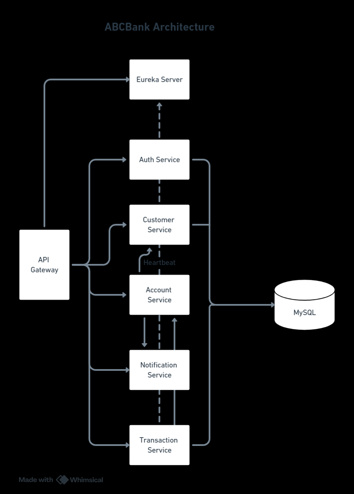

# ABC Bank

ABC Bank is a web application for bank management. It is developed using Java, Kotlin, Spring Boot, Spring Cloud, Spring Security, Angular, MySQL, Gradle,and Maven.

## Architecture



## Microservices

The application is divided into five microservices:

### 1. Customer Service

The Customer Service handles the management of bank customers, including registration, modification, deletion, and more.

### 2. Account Service

The Account Service is responsible for managing bank accounts, including account creation, deletion, modification, as well as handling banking operations like credit and debit transactions.

### 3. User Service

The User Service is in charge of user management and authentication within the application.

### 4. Transaction Service

The Transaction Service is in charge of fund transfers from one account to another.

### 5. Notification Service

The Notification Service is in charge of sending email notifications to customer for debits and credits.


## Additional Services

In addition to the core microservices, the application also includes the following services:

### Gateway Service

The Gateway Service serves as a gateway for the application, providing routing and security features using Spring Cloud Gateway.

### Discovery Service

The Discovery Service acts as a registration and discovery server for microservices using Eureka Discovery Server.

### Web UI

The Web UI is the user interface for administrative purposes, developed using Angular and Bootstrap.

## Prerequisites

Before running the application, ensure that you have the following prerequisites installed:

- Java 17
- Angular CLI 16.2.2
- MySQL
- Maven
- Gradle
- Kotlin
- Grafana Stack(Loki, Tempo, Prometheus, Grafana)
- Docker/Docker Compose

## Getting Started

1. Clone this repository.
2. Configure the local development environment to install all software required by running command
    ``` 
         docker compose up -d
    ```
3. Build each microservice using Maven or Gradle by command below
    ```
        ./mvnw clean install package
        ./gradlew clean build
    ```
   Run each microservice just like we run any jar application with below command
    ``` 
         java -jar microservice.jar
    ```
4. You must start the services in the following order: discovery-service, gateway-service, customer-service, notification-service , account-service, transaction-service, auth-service, web-ui.
5. Start the Gateway Service and Discovery Service.
6. Launch the Web UI to access the admin interface using below command. Only limited functionality is available in Ui.
    ```
         npm start
    ```

## Usage

- Access the Web UI at [http://localhost:4200](http://localhost:4200) to manage the bank administration.
- Access the Discovery Service at [http://localhost:8761](http://localhost:8761) 
- Access the SMTD Server at [http://localhost:1080](http://localhost:1080) 

## Documentation

- Access the Centralized Swagger Documentation  [http://localhost:8888](http://localhost:8888) to check contract of each REST API.


## Observability

- Access the Observability Grafana Dashboard  [http://localhost:3000](http://localhost:3000) to check metrics, centralized logging and traces. Observability is implemented by using Grafana, Loki, Tempo and Prometheus stack.

## Security

- Security is implemented using JWT tokens.


## Acknowledgments

- Special thanks to the Spring and Angular communities for their excellent frameworks and resources.
- Inspired by the world of banking and financial services.

## Author and Developer

- Ankur Pathak
